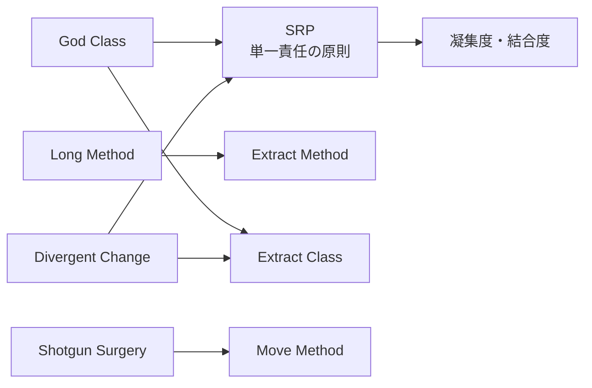
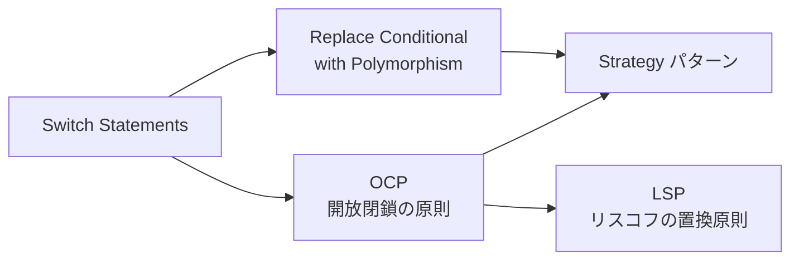
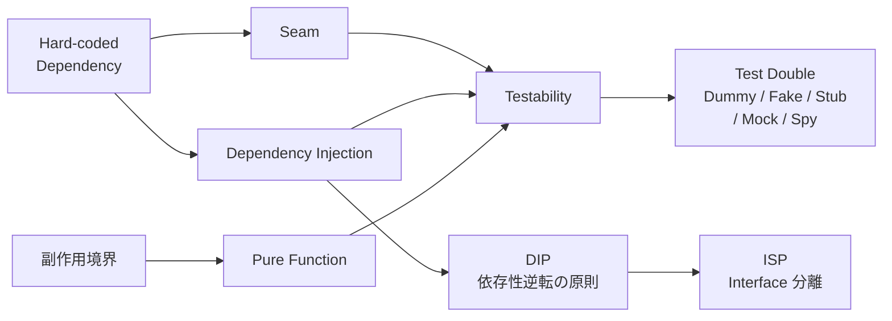
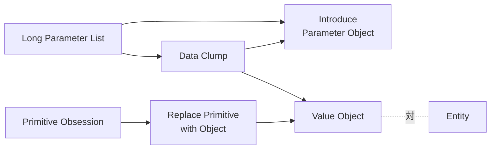
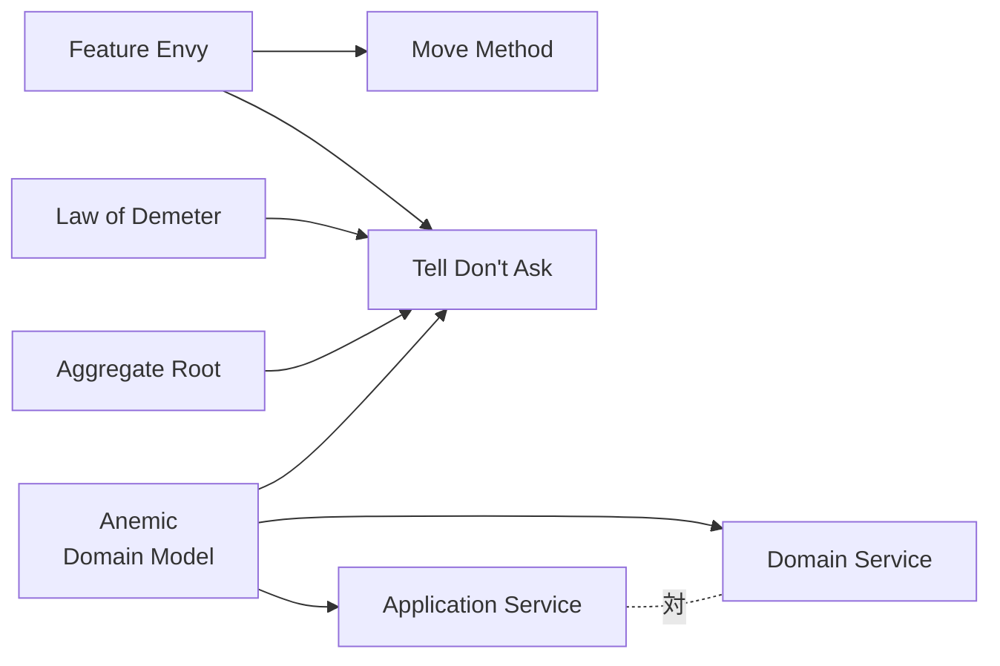
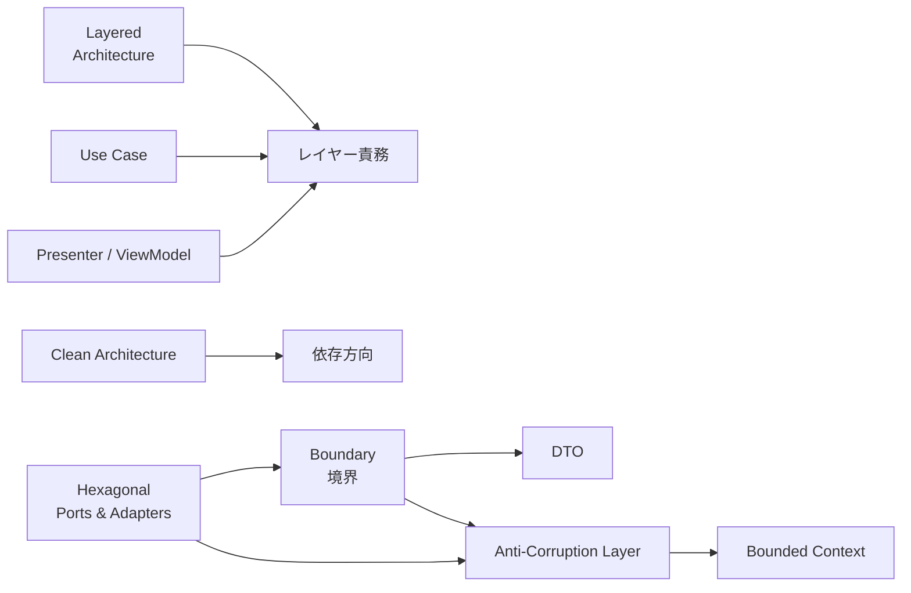
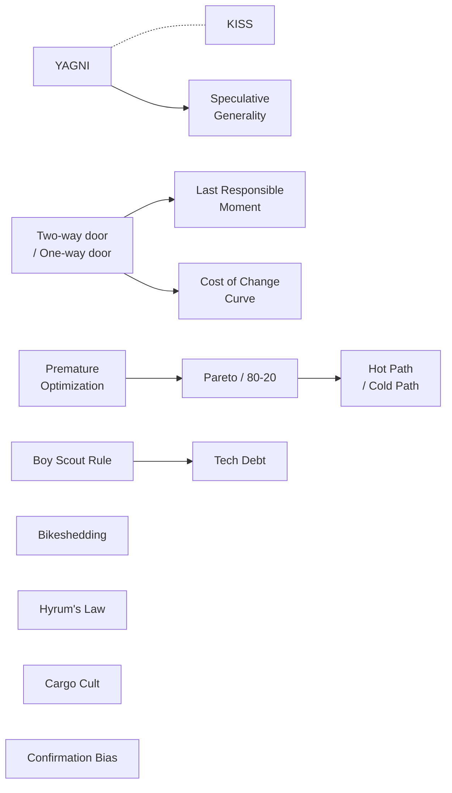
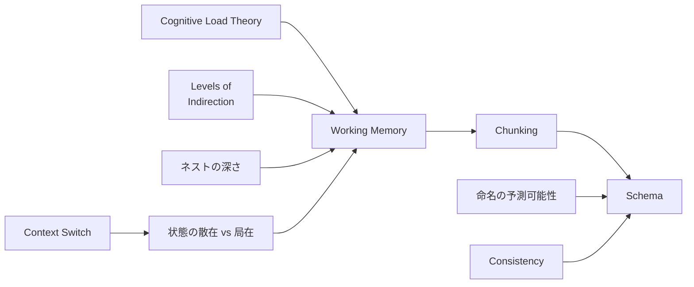
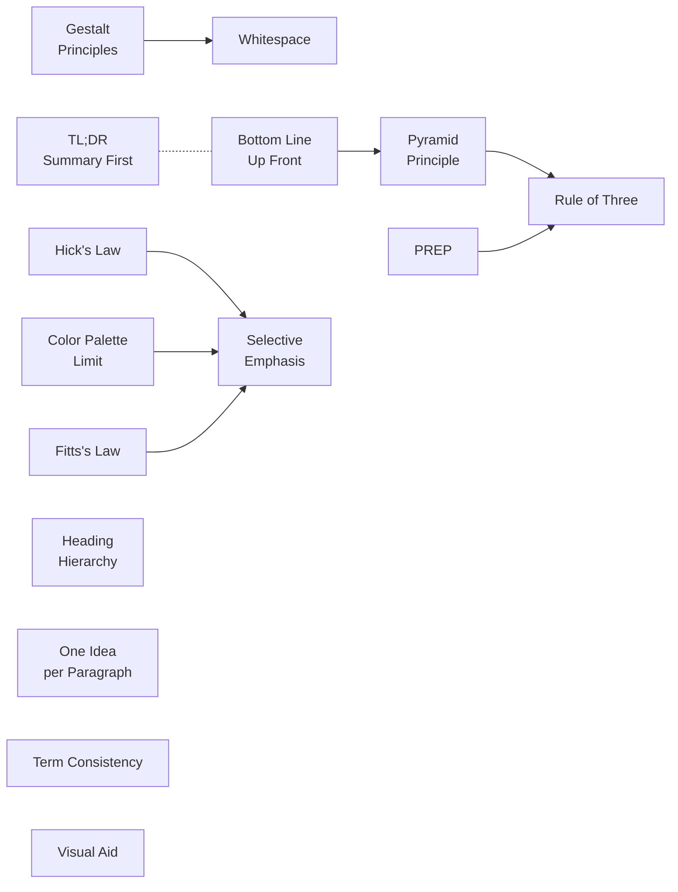
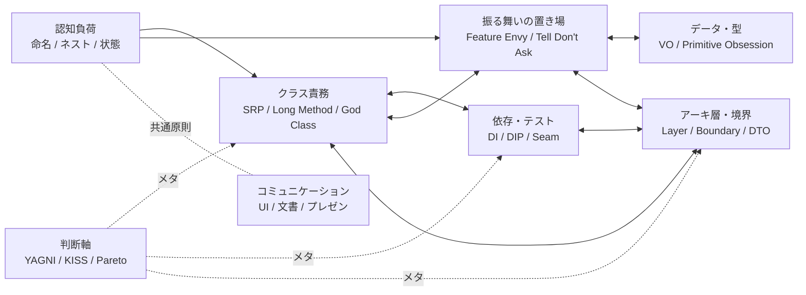

# 概念マップ (Concept Graph)

主要語彙の関係を俯瞰する図  各 vocab ファイルの `**関連**:` 行を統合した「学習・議論用の地図」

詳細は対応する `vocab-*.md` を参照

## クラス責務クラスタ (構造の臭い ↔ 設計原則 ↔ リファクタリング手法)

## 拡張性クラスタ (分岐 ↔ ポリモーフィズム)

## 依存・テスト容易性クラスタ

## データ・型クラスタ

## 振る舞いの置き場所クラスタ (DDD の核)

## アーキ層・境界クラスタ

## 判断軸クラスタ (議論のメタレベル)

## 認知負荷クラスタ (コード表現、[vocab-cognitive-load.md](vocab-cognitive-load.md))

## コミュニケーションクラスタ (UI / 文書 / 会話、[vocab-communication.md](vocab-communication.md))

## クラスタ間の太いつながり

## 使い方

**学習用**: クラスタ単位で学ぶと記憶が定着する  個別語彙より「群れの中での位置付け」で覚える

**議論用**: 議論が空中戦になったら、現在の論点がどのクラスタかを最初に揃える  例: 「Long Method の話 (クラス責務クラスタ) と Hard-coded Dependency の話 (依存・テスト容易性クラスタ) は別軸なので分けて議論する」

**Skill 用**: 検出した指摘がどのクラスタに属するかで関連指摘の探索範囲を絞れる  例: SRP 違反を検出したら同クラスタの Long Method / God Class / Divergent Change も同時にチェック

## 注意

- 本図は **網羅ではなく俯瞰**  個別の関係性は各 `vocab-*.md` の `**関連**:` 行を参照
- 太いつながり図は概念整理のための簡略化  実際にはクラスタ間に多数のクロス参照がある
- 図の更新は [INDEX.md](INDEX.md) との整合性を保つこと
